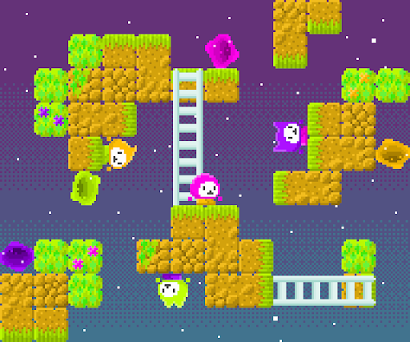

# Gravity Guys

## Descripción

Gravity Guys es un juego de plataformas 2D que fusiona acción y acertijos en un desafío gravitacional único. Controla a 4 personajes alternadamente, cada uno con su propia gravedad especial, resolviendo acertijos para avanzar.

## Características Principales

- **Cooperación Estratégica:** Alterna entre 4 personajes para superar desafíos y avanzar en niveles ingeniosos.

- **Puzzles Gravitacionales:** Enfréntate a acertijos que requieren coordinación y dominio de las gravedades únicas de cada personaje.

- **Diseño Personalizado:** Gráficos internos y música original para una experiencia inmersiva.

## Tecnologías Utilizadas

- **Godot:** Motor de videojuegos de código abierto.
- **GDScript:** Lenguaje de programación de Godot.

## Instalación

1. Abrir el archivo `Gravity Guys.exe` para iniciar el juego.

2. ¡Disfrutar!

## Créditos

### Programación y Diseño

- Javier Lavados
- José Triviño
- Cristóbal Saldías

### Música

- Tomás Rivera